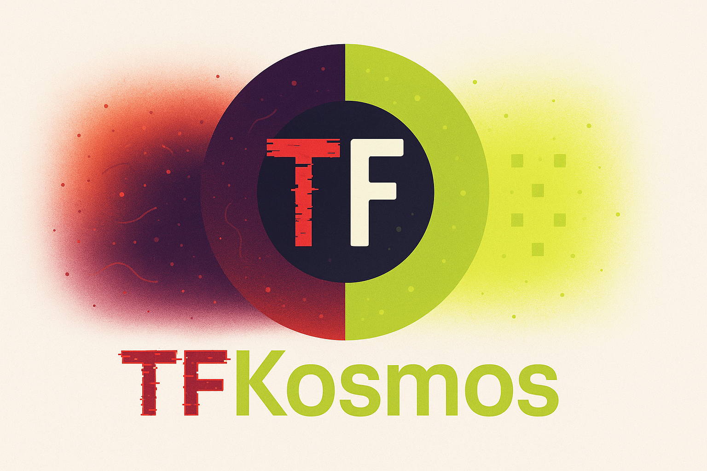

# TFKosmos

<div align="center">
  
</div>

[](https://codecov.io/gh/masayaWada/TFKosmos)

## TFKosmos について 🚀

TFKosmos は、既存のクラウド環境（実機構成）を解析し、
Terraform のコードおよび import 定義を再構築するためのツールです。

多くの現場では、長年の運用や障害対応、緊急変更の積み重ねによって、
インフラの実態がコードとして表現されないまま複雑化していきます。
このような状態は、再現性・可視性・保守性の面で大きな課題となります。💡

TFKosmos は、その **混沌（Chaos）** とした実機構成を一度正しく理解し、
Terraform という **秩序（Cosmos）** あるコードへと再構成することを目的としています。

## ツールの特徴 ✨

- 🔍 既存のクラウドリソース構成を解析し、Terraform コードを生成
- 🤖 Terraform import に必要な定義を自動的に構築
- 📦 手動運用・属人化した構成から IaC への移行を支援
- 🔒 既存環境を壊すことなく、段階的な Terraform 管理への移行が可能

TFKosmos は「新しく作る」ためのツールではなく、
すでに存在している現実のインフラを、最短距離で Terraform 管理へ導くことに重きを置いています。

## 名前の由来 📖

TFKosmos は、以下の 2 つの言葉から構成されています。

- **TF**：Terraform
- **Kosmos**：秩序・調和（ギリシャ語）

ギリシャ神話において Kosmos は、
混沌（Chaos）から生まれた、秩序だった世界を意味します。✨

TFKosmos という名前には、

**混沌とした実機構成（Chaos）を、**
**Terraform によって秩序あるコード（Cosmos）へ変換する**

という思想が込められています。

## 理念 💭

**From Chaos to Cosmos.**

TFKosmos は、
インフラを「破壊する」ためのツールではありません。🛡️

現実に存在する構成を正しく読み解き、
Terraform という共通言語に翻訳し、
再現性と秩序を取り戻すためのツールです。

## 機能 🎯

### クラウドリソーススキャン
- ☁️ **AWS**: IAM（Users, Groups, Roles, Policies）、EC2、VPC/Subnet/RouteTable、Security Group/Network ACL、S3、RDS、Lambda、DynamoDB、ELB（ALB/NLB）、CloudWatch、SNS
- 🔷 **Azure**: IAM（Role Definitions, Role Assignments）、Virtual Machine、Virtual Network、NSG、Storage Account、SQL Database、App Service、Function App

### Terraform生成・管理
- 📝 Terraformコードの自動生成（カスタムテンプレート対応）
- 📜 importスクリプトの自動生成（`.sh` / `.ps1`）
- 🔍 ドリフト検出（Terraform stateと実リソースの差分検出）
- ✅ Terraform検証（`terraform validate` / `terraform fmt`）

### 運用・管理機能
- 📊 依存関係グラフの可視化
- 📋 監査ログ（API操作の記録・検索）
- ⚙️ 設定管理API（接続設定のCRUD、JSON/TOML対応）
- 📤 エクスポート（CSV/JSONフォーマット）
- 🔎 リソースクエリ言語（`==` / `!=` 演算子対応）
- 💻 CLIモード対応

### UI・デスクトップ
- 🌐 多言語対応（日本語/英語）
- 🎨 ダークモード/ライトモード切り替え
- 🖥️ Tauriデスクトップアプリケーション（macOS / Windows / Linux）

## セットアップ 🛠️

### 必要なもの

- 🦀 Rust 1.70以上（[rustup](https://rustup.rs/)でインストール）
- 📦 Node.js 18以上
- npm または yarn
- 🏗️ Terraform CLI 1.0以上（検証機能を使用する場合）**オプション**

### バックエンド（Rust）

```bash
# Rustがインストールされていることを確認
rustc --version
cargo --version

# 注意: cargoコマンドが見つからない場合、以下を実行してください
# source ~/.cargo/env

# バックエンドディレクトリに移動
cd backend

# 依存関係のインストール（初回ビルド時に自動的に実行されます）
cargo build

# 開発モードで実行
cargo run
```

#### トラブルシューティング 💡

依存関係のインストールに失敗する場合：

1. **Rustのバージョン確認**

   ```bash
   rustc --version  # 1.70以上が必要
   ```

2. **ビルドツールのインストール**
   - **macOS**: `xcode-select --install`
   - **Linux (Debian/Ubuntu)**: `sudo apt install build-essential libssl-dev pkg-config`
   - **Linux (Fedora)**: `sudo dnf groupinstall "Development Tools" && sudo dnf install openssl-devel`

3. **依存関係の更新**

   ```bash
   cargo update
   ```

4. **キャッシュのクリア**（問題が続く場合）

   ```bash
   cargo clean
   rm -rf ~/.cargo/registry/cache
   cargo build
   ```

### フロントエンド

```bash
cd frontend
npm install
```

### Terraform CLI（オプション） 🏗️

生成されたTerraformコードの検証・フォーマット機能を使用する場合は、Terraform CLIが必要です。

#### インストール方法

##### macOS（Homebrew使用）

```bash
brew tap hashicorp/tap
brew install hashicorp/tap/terraform
```

##### macOS（公式バイナリ）

```bash
# 最新バージョンをダウンロード
wget https://releases.hashicorp.com/terraform/1.6.0/terraform_1.6.0_darwin_amd64.zip

# 解凍してインストール
unzip terraform_1.6.0_darwin_amd64.zip
sudo mv terraform /usr/local/bin/

# バージョン確認
terraform version
```

##### Linux（Debian/Ubuntu）

```bash
wget -O- https://apt.releases.hashicorp.com/gpg | sudo gpg --dearmor -o /usr/share/keyrings/hashicorp-archive-keyring.gpg
echo "deb [signed-by=/usr/share/keyrings/hashicorp-archive-keyring.gpg] https://apt.releases.hashicorp.com $(lsb_release -cs) main" | sudo tee /etc/apt/sources.list.d/hashicorp.list
sudo apt update && sudo apt install terraform
```

##### Windows（Chocolatey使用）

```powershell
choco install terraform
```

#### インストール確認

```bash
terraform version
```

以下のような出力が表示されれば成功です：

```
Terraform v1.4.4
on darwin_amd64
```

#### 検証機能について

Terraform CLIがインストールされている場合、以下の機能が利用可能になります：

- ✅ **構文検証**: 生成されたTerraformコードの構文エラーをチェック
- 📐 **フォーマットチェック**: コードのフォーマットが正しいか確認
- 🔧 **自動フォーマット**: コードを自動的に整形

Terraform CLIがインストールされていない場合でも、基本的なコード生成機能は正常に動作します。

## セキュリティ設定 🔒

TFKosmosでは、Claude Codeの権限制御機能を使用して、危険なコマンドの実行を防止しています。

### 権限設定について

プロジェクトルートの `.claude/settings.json` には、以下のセキュリティ設定が含まれています：

- **許可されたコマンド（allow）**: 開発に必要な安全なコマンド（cargo, npm, git, terraformなど）
- **拒否されたコマンド（deny）**: 危険なコマンドと機密情報へのアクセス

#### 拒否されている主な操作

- 🚫 システム破壊的コマンド: `rm -rf /`, `sudo`, `dd`など
- 🚫 環境変数ファイルの読み書き: `.env`, `.env.*`
- 🚫 AWS/Azure認証情報: `~/.aws/credentials`, `~/.azure/`
- 🚫 SSHキー: `~/.ssh/id_rsa`, `~/.ssh/id_ed25519`

#### カスタマイズ

個人の環境に応じた設定は `.claude/settings.local.json` で行えます（git管理外）。

詳細は [Claude Code IAMドキュメント](https://code.claude.com/docs/en/iam.md) を参照してください。

## 実行方法 🚀

### 方法1: 同時起動（推奨） ⭐

フロントエンドとバックエンドを同時に起動する方法：

#### Makefileを使用（推奨）

```bash
# フロントエンドとバックエンドを同時に起動（推奨）
make dev

# バックエンドのみ起動
make dev-backend

# フロントエンドのみ起動
# 注意: スキャン機能を使用するには、バックエンドも起動している必要があります
make dev-frontend

# 利用可能なコマンドを確認
make help
```

> **💡 重要**: スキャン機能を使用するには、フロントエンドとバックエンドの両方が起動している必要があります。
> `make dev-frontend`のみを実行した場合、バックエンドに接続できず`ECONNREFUSED`エラーが発生します。

#### シェルスクリプトを使用

```bash
./dev.sh
```

#### Cursor/VS Codeのタスクを使用

1. `Cmd+Shift+P` (macOS) または `Ctrl+Shift+P` (Windows/Linux) でコマンドパレットを開く
2. `Tasks: Run Task` を選択
3. `dev: フロントエンド + バックエンド` を選択

または、`Cmd+Shift+B` (macOS) でタスクを実行できます。

**注意**: タスクを停止するには、ターミナルパネルで `Ctrl+C` を押してください。

### 方法2: 個別に起動

#### バックエンド起動

```bash
# 注意: cargoコマンドが見つからない場合、先に以下を実行してください
# source ~/.cargo/env

# バックエンドディレクトリに移動
cd backend

# 開発モード（ホットリロードなし）
cargo run

# リリースモード（最適化済み）
cargo run --release
```

サーバーは `http://0.0.0.0:8000` で起動します。

**注意**: 新しいターミナルセッションでは、`source ~/.cargo/env`を実行するか、シェルの設定ファイル（`.zshrc`や`.bashrc`）に以下を追加してください：

```bash
source "$HOME/.cargo/env"
```

#### フロントエンド起動

```bash
cd frontend
npm run dev
```

フロントエンドは `http://localhost:5173` で起動します。

## ビルド方法 📦

### 開発用ビルド

開発用に最適化されたビルドを実行します：

```bash
make build
```

これにより、以下のビルドが実行されます：
- バックエンド: `cargo build`
- フロントエンド: `npm run build`

### リリース用ビルド（インストーラ生成）

本番環境用に最適化されたビルドと、デスクトップアプリのインストーラを生成します：

```bash
make release
```

**生成されるファイル:**

- バックエンドバイナリ: `backend/target/release/tfkosmos`
- Tauriデスクトップアプリのインストーラ: `deployment/src-tauri/target/release/bundle/`
  - **macOS**: `.dmg` (インストーラ), `.app` (アプリケーションバンドル)
  - **Windows**: `.msi` (インストーラ)

### ビルド成果物のクリーンアップ

ビルド成果物を削除してクリーンな状態に戻します：

```bash
make clean
```

## プロジェクト構造

``` bash
tfkosmos/
├── backend/          # バックエンド（Rust）
│   ├── src/          # Rustソースコード
│   │   ├── main.rs   # エントリーポイント
│   │   ├── api/      # APIルーティング（routes/, audit_middleware, security_headers）
│   │   ├── services/ # ビジネスロジック（scan, resource, generation, audit, drift, config, export等）
│   │   ├── models/   # データモデル（リクエスト/レスポンスDTO）
│   │   ├── infra/    # インフラストラクチャ層（aws/, azure/, generators/, templates/, query/, terraform/）
│   │   ├── domain/   # ドメインモデル（AWS: iam/ec2/vpc/rds/s3/lambda/dynamodb, Azure: iam/compute/network/storage/sql/app_service）
│   │   └── cli/      # CLIコマンド
│   ├── Cargo.toml    # Rust依存関係
│   ├── templates_default/ # デフォルトテンプレート
│   └── templates_user/   # ユーザーカスタムテンプレート（.gitignore、実行時に生成される）
├── frontend/         # フロントエンド（React）
│   ├── src/          # Reactソースコード
│   │   ├── api/      # APIクライアント
│   │   ├── components/ # 再利用可能UIコンポーネント
│   │   ├── context/  # Reactコンテキスト（テーマ管理）
│   │   ├── hooks/    # カスタムフック（useI18n, useTheme）
│   │   ├── i18n/     # 多言語対応（ja.json, en.json）
│   │   ├── pages/    # ページコンポーネント
│   │   └── styles/   # グローバルスタイル（テーマ定義）
│   ├── package.json  # Node.js依存関係
│   └── vite.config.ts # Vite設定
├── deployment/       # デスクトップアプリ（Tauri）
│   ├── src-tauri/    # Tauri Rustプロジェクト
│   └── package.json  # Tauriアプリ用設定
├── tests/            # E2Eテスト・モック
│   ├── e2e/          # Playwright E2Eテスト
│   └── mock/         # モックサーバー
├── scripts/          # ユーティリティスクリプト
├── docs/             # 開発ドキュメント
│   ├── README.md     # ドキュメントインデックス
│   ├── 01_基礎/      # プロジェクト概要
│   ├── 02_設計仕様/   # アーキテクチャ・API仕様
│   ├── 03_開発ガイド/ # 開発手順・CLI使い方
│   ├── 04_品質管理/   # テスト戦略・セキュリティ
│   ├── 05_運用サポート/ # デプロイ・リリース手順
│   └── 06_ロードマップ/ # 今後の計画
├── Makefile          # 開発用コマンド
├── dev.sh            # 開発用起動スクリプト
└── README.md         # このファイル
```

## 技術スタック 🛠️

### 技術スタック-バックエンド

- **Rust**: システムプログラミング言語
- **Axum**: 非同期Webフレームワーク
- **Tokio**: 非同期ランタイム
- **AWS SDK for Rust**: AWS API連携
- **Azure SDK for Rust**: Azure API連携
- **Minijinja**: テンプレートエンジン（Jinja2互換）
- **utoipa**: OpenAPI/Swagger UI生成

### 技術スタック-フロントエンド

- **React 18**: UIフレームワーク
- **TypeScript**: 型安全なJavaScript
- **Vite**: ビルドツール
- **@xyflow/react**: 依存関係グラフの可視化
- **Monaco Editor**: コードエディタ
- **Vitest**: ユニットテスト
- **Playwright**: E2Eテスト

### 技術スタック-デスクトップアプリ

- **Tauri 2.x**: クロスプラットフォームデスクトップアプリフレームワーク

## ドキュメント 📚

開発用ドキュメントは [`docs/`](./docs/) ディレクトリにカテゴリ別に整理されています。

- **[開発ドキュメント一覧](./docs/README.md)** - ドキュメントのインデックス
- `01_基礎/` - プロジェクト概要、用語集
- `02_設計仕様/` - アーキテクチャ、データモデル、API仕様
- `03_開発ガイド/` - 開発手順、CLIの使い方
- `04_品質管理/` - テスト戦略、セキュリティ
- `05_運用サポート/` - デプロイガイド、リリース手順
- `06_ロードマップ/` - 今後の計画
